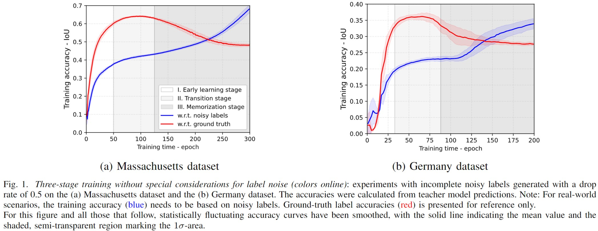
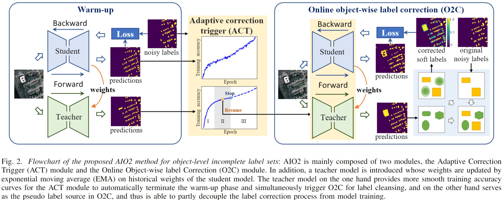

# AIO2

This repository is for the codes of the TGRS paper "[AIO2: Online Correction of Object Labels for Deep Learning with Incomplete Annotation in Remote Sensing Image Segmentation](https://ieeexplore.ieee.org/document/10460569)"

## Memorization effects
The concept of *Memorization effects* was originally proposed to imply a two-stage training with noisy labels. In the first early-learning stage, model performance is continuously improved by dominant learning from most of the accurately labeled samples. In the later memorization stage, model performance begins to be degraded for overfitting to label noise information.

In this work, we reinterpret this phenomenon as a three-stage training with noisy labels, adding a transition stage between the early-learning and memorization stages, where the model performance plateaus before overfitting to label noise, as shown in Fig. 1.



## Methodology
Based on the above observation, we proposed AIO2 for object-level incomplete label sets, which is mainly composed of two modules, the Adaptive Correction Trigger (ACT) module and the Online Object-wise label Correction (O2C) module:
- ACT is used to adaptively ceases the training when the model starts overfitting to noisy labels in the warm-up (detecting the transition phase during the training with noisy labels). After that, O2C comes into force for sample correction.
- O2C selects pseudo label candidates in an object-wise fashion, using a smooth filter to generate soft boundaries for candidate pseudo objects. This is the major improvement of O2C compared to commonly used pixel-wise correction strategies. Additionally, ``online'' in the O2C name includes one-off label correction at each iteration without saving historical correction results. This is another major difference from commonly used pixel-wise correction strategies, which correct labels incrementally.

In addition, a teacher model is introduced whose weights are updated by exponential moving average (EMA) on historical weights of the student model. The teacher model on the one hand provides more smooth training accuracy curves for the ACT module to automatically terminate the warm-up phase and simultaneously trigger O2C for label cleansing, and on the other hand serves as the pseudo label source in O2C, and thus is able to partly decouple the label correction process from model training.



## Citation:
If you find the codes are useful, please cite our work:
```
@ARTICLE{liu-aio2,
  author={Liu, Chenying and Albrecht, Conrad M and Wang, Yi and Li, Qingyu and Zhu, Xiao Xiang},
  journal={IEEE Transactions on Geoscience and Remote Sensing}, 
  title={AIO2: Online Correction of Object Labels for Deep Learning with Incomplete Annotation in Remote Sensing Image Segmentation}, 
  year={2024},
  volume={},
  number={},
  pages={in process},
  doi={10.1109/TGRS.2024.3373908}}
```
