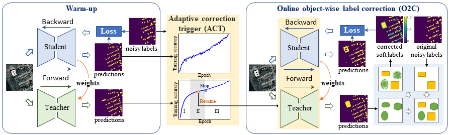

# AIO2: Online Correction of Object Labels for Deep Learning with Incomplete Annotation in Remote Sensing Image Segmentation

This repository is for the codes of the TGRS paper "AIO2: Online Correction of Object Labels for Deep Learning with Incomplete Annotation in Remote Sensing Image Segmentation"

## Methodology

